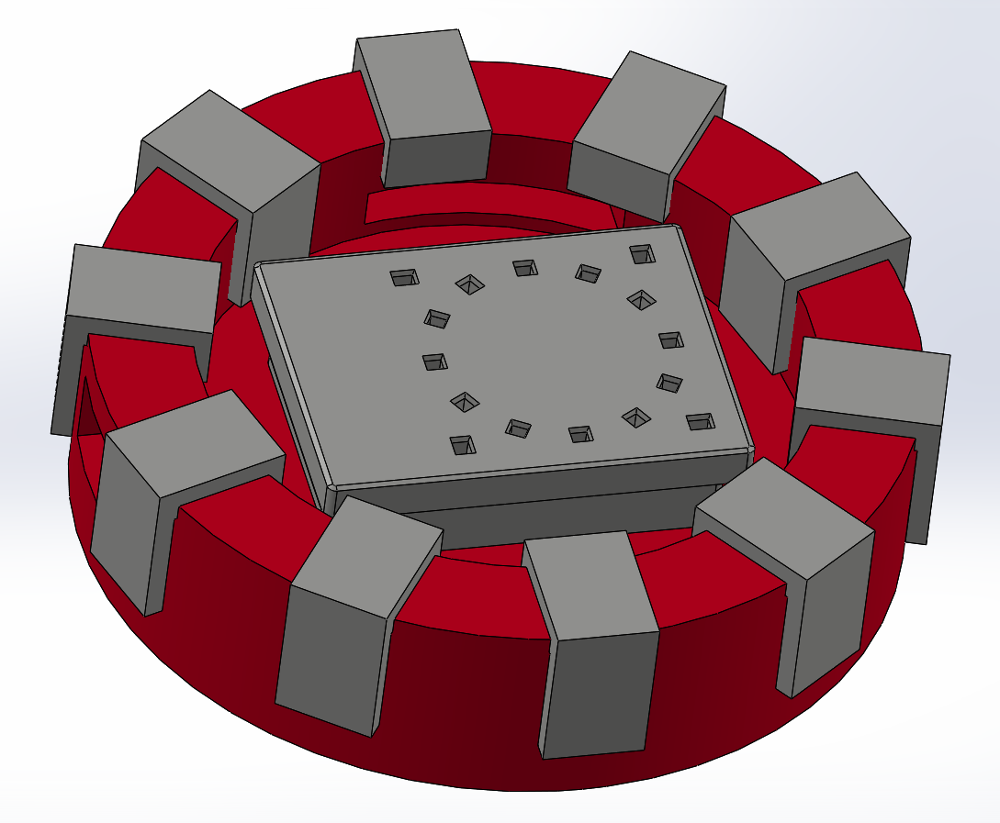

# JARVIS-GPT

 

## Description

JARVIS-GPT is a personal project with the aim of replicating the functionality of Just A Rather Very Intelligent System (J.A.R.V.I.S.) from the Iron Man movies. With recent advancements in deep learning and natural language processing, technologies that were often portrayed as futuristic in Hollywood movies (think JARVIS from Iron Man, C-3PO from Star Wars, etc.) are becoming a reality. Inspired by [Boston Dynamic's integration of ChatGPT on their Spot robot](https://bostondynamics.com/blog/robots-that-can-chat/), I designed a framework that uses high-level API calls to emulate the capabilites of the fictional JARVIS system.

In addition to the conversational abilities of OpenAI's GPT models, JARVIS-GPT takes advantage of [function calling](https://platform.openai.com/docs/guides/function-calling) to perform other actions such as,
- Accessing the current date and time
- Accessing the current weather conditions at any location
- Accessing the daily weather forecast up to 8 days in the future at any location
- Reading, writing, and deleting notes organized by date and time
- Turning smart lights on/off and changing brightness

And perhaps it is just a glorified DIY Alexa... but at least, in my opinion, it looks and sounds cool in the process :D

### *DEMO VIDEO COMING SOON\*

## Hardware

The main hardware consists of a Raspberry Pi 4B with a [Respeaker 4-mic Array Hat](https://wiki.seeedstudio.com/ReSpeaker_4_Mic_Array_for_Raspberry_Pi/) for audio detection. These components are housed in a 3D-printed enclosure, with openings for the microphones and LEDs. The design of the enclosure was inspired by the Arc Reactor and the red/silver PLA was chosen to match the colorway of the MK5 suit. The audio is output through the 3.5mm jack to an amplifier that is connected to two wall-mounted speakers.

  

## Software

Main Packages:
- [SpeechRecognition](https://github.com/Uberi/speech_recognition#readme)
- [OpenAI](https://platform.openai.com/docs/introduction)
- [ElevenLabs](https://github.com/elevenlabs/elevenlabs-python)
- [PyOWM](https://pyowm.readthedocs.io/en/latest/) for [OpenWeatherMap](https://openweathermap.org/api)
- [PHue](https://github.com/studioimaginaire/phue) for Philips Hue smart lights

Each time JARVIS is activated, [main.py](https://github.com/henrynoyes/jarvis-gpt/tree/master/main.py) listens for speech, translates the speech to text, queries GPT with the text, performs any necessary function calling, and finally converts the text response to speech in a custom JARVIS voice. The framework was designed to be as simple as possible in the hopes that others can easily interpret the code and make their own modifications if desired. See the [template](https://github.com/henrynoyes/jarvis-gpt/tree/template) branch for a bare-bones implementation that is stripped of many of the custom applications.

There are two options for activation. `boot_wakeword` uses Picovoice's [porcupine](https://github.com/Picovoice/porcupine) to perform on-device wakeword detection and activates JARVIS every time his name is mentioned. `boot_button` takes advantage of RF transmission to activate JARVIS at the press of a wireless button, much like a TV remote.

To ensure privacy, all personal information such as API keys are stored locally in environment variables and accessed using [os](https://docs.python.org/3/library/os.html). See [OpenAI's API Key Guide](https://help.openai.com/en/articles/5112595-best-practices-for-api-key-safety) for instructions on how to set environment variables on Linux/Windows/MacOS. Here is a list of all custom environment variables:

- OPENAI_API_KEY - Used for all queries to GPT models. Find it [here](https://help.openai.com/en/articles/4936850-where-do-i-find-my-api-key)
- ELEVEN_API_KEY - Used for all TTS. Find it [here](https://elevenlabs.io/docs/api-reference/text-to-speech#authentication)
- OWM_API_KEY - Used for the `get_current_weather` and `get_future_weather` functions. Find it [here](https://openweathermap.org/appid#signup)
- PICOVOICE_API_KEY - Used for wakeword activation. Find it [here](https://picovoice.ai/docs/quick-start/picovoice-python/#picovoice-account--accesskey)
- JARVIS_LOCATION - Used as the default location for the `get_current_weather` and `get_future_weather` functions. In the form `'city,state,US'` for US cities and `'city,country'` for elsewhere. Ex: `'Phoenix,AZ,US'` or `'London,GB'`
- JARVIS_VOICEID - Used for all TTS. Find the list of voices [here](https://github.com/elevenlabs/elevenlabs-python?tab=readme-ov-file#%EF%B8%8F-voices).
- PHUE_IP – Used for the `power_lights` and `change_brightness` functions. Found in the [Philips Hue app](https://www.philips-hue.com/en-us/explore-hue/apps/bridge)

`config.yaml` can be edited to configure default settings for startup and shutdown

Listen below for some example speech from the custom JARVIS voice model:

https://github.com/henrynoyes/jarvis-gpt/assets/107648313/77035885-382b-46c0-b3b9-a7d1ed7723c0

## Morning Message (MacOS)

I developed a secondary functionality for JARVIS on MacOS. With the push of a button, JARVIS will parse your notification center, pull daily weather data, and give you a motivating and informative morning message to get the day started. To configure this, I mapped a keyboard shortcut to an [automator workflow](https://support.apple.com/guide/automator/use-a-shell-script-action-in-a-workflow-autbbd4cc11c/mac) that runs [good_morning.py](https://github.com/henrynoyes/jarvis-gpt/tree/macos-dev/good_morning.py) (in the appropriate environment). Within the python script is a modified version of the main JARVIS class from the original implementation, which calls to OpenWeatherMap for a daily forecast and fetches notification data using an [AppleScript](https://github.com/henrynoyes/jarvis-gpt/tree/macos-dev/notif.scpt). See an example of this in action in the video below.

https://github.com/henrynoyes/jarvis-gpt/assets/107648313/ffaeb136-671c-473f-ab0f-88dfe4fde68c

## Future Developments

- Integrate with [OpenInterpreter](https://github.com/OpenInterpreter/open-interpreter). May require large rework, but their progress looks promising. Could be a massive step towards more advanced features like text-to-CAD, but want to keep TTS the same and have freedom in function calling.
- Allow multiple exchanges with historical context, more like ChatGPT (ex: "Read me my notes from yesterday" $\rightarrow$ "Delete the second one")
- Replace startup mp3 with custom message detailing date, time, and weather
- Replace local notetaking functionality with a cloud-based application that can be accessed from other devices (mobile/PC)
- Integrate text-to-3D-models using [Shape-E](https://github.com/openai/shap-e) ("Hey JARVIS, make me a 3D model of ...") $\vert$ Long term: text-to-CAD? ("Hey JARVIS, create a CAD model of a box with dimensions ... Add a cylinder on top with dimensions ... and position it ...")
